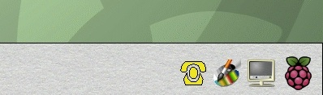
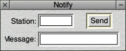
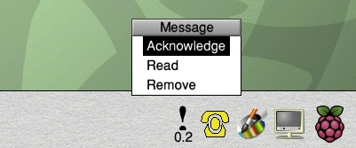
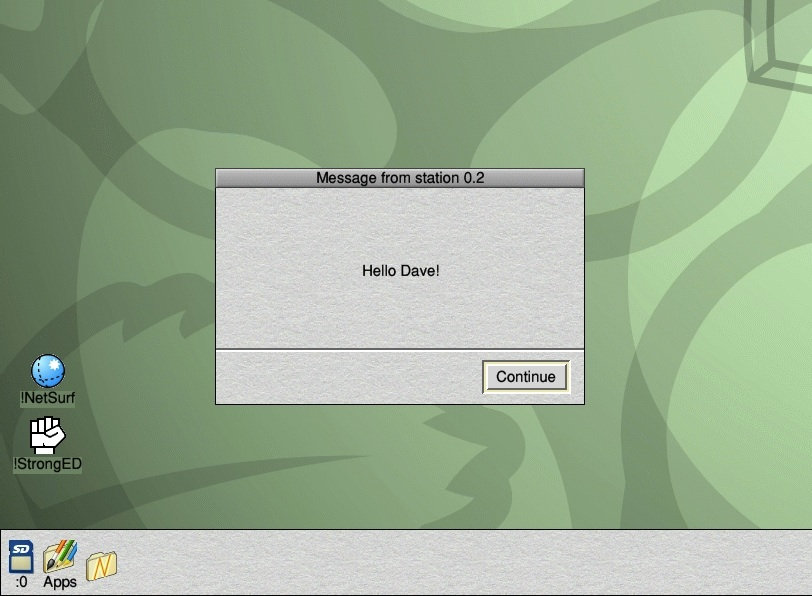

# !Notify

Early Archimedes machines shipped with a built in facility for sending short
messages to other workstations. Some Googling [suggests that RiscOS 2 had this
built in](http://beebmaster.co.uk/A4201-5.html) as a menu option:

There was also a * command (this was the RiscOS CLI) that would notify another
station.

Messages always popped straight up in the middle of your screen - stealing full
control of your workstation until you dismissed them. They were pretty
annoying - and this is probably why in our school they were disabled. I think
this was just by blocking the appropriate port.

However it came about - the ability to "notify" went away. So I built a
replacement. Both the sender workstation and receiver workstation would have
to be running !Notify for it to work.

If you're on a RiscOS machine, you can download a working copy here.

The src folder contains a version of each file that you can browse. In reality
this isn't what the source looks like. This is because:

  - BBC Basic files are tokenized and stored as binary _whereas I've converted
    !RunImage and Wimp to text_
  - Templates are a binary format that defines loadable windows for use in the
    application _whereas I've taken a screenshot of each window as shown in
    the !FormEd tool_
  - !Sprites are usually in an Acorn-specific format - and can contain any
    number of named images _whereas I've taken a screenshot of how they look
    in !Paint_

## How it works

The original !Help file is worth a read!

Loading the program adds it to the icon bar.

You can send a message to any workstation that you know the number of. This
sounds slightly barmy in today's world of DHCP-enabled LANs (or indeed
the Internet), but when I wrote the program the machines in our computer room
where numbered in ascending order.

If using the default config, the message appears on the icon bar of the target
machine.

There is a menu (Acorns all had context-sensitive menus by pressing the middle
button of a three button mouse). Or you can just click on the message icon
to view the message. This opens a window in the middle of the screen which
constrains the mouse, forcing you to read and dismiss it (mimicking the
behaviour of the original notify feature).

