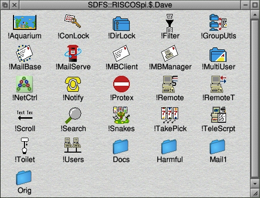

# RiscOS

In the winter of 2012/13 I came to find a stash of software I wrote between
roughly 1992 and 1996, for the [Acorn](http://en.wikipedia.org/wiki/Acorn_Computers)
[Archimedes](http://en.wikipedia.org/wiki/Acorn_Archimedes) computers
 At that time I was in secondary school and I spent roughly 3 hours each day
in "computer club" programming. This was roughly between the ages of 12 and 16.

I had been meaning to locate this software for a while. The straw that broke
the camel's back was the [release of RiscOS for the Raspberry Pi](http://www.raspberrypi.org/archives/2338);
 an image that can be chucked on an SD card to turn my £20 Pi into a machine
far more capable than the machines I was working with at the time. It worked
like a dream.

The person who actually found the code was Brian Kiff, a long term friend and
one time mentor. Brian basically taught me to program whilst I was at school.
I guess I was lucky that _someone_ knew how to; the teachers certainly didn't.

## The haul

I've lumped all the software into this repository to make life easier. Each
program I wrote has a folder which contains a binary download (that you can
actually download and use on a RiscOS machine) plus "converted" browseable
source. I've tried to turn all the files into something that you can just
view via Github, so the BASIC source code has been detokenized and the sprites
have been turned into PNGs etc. Some of the programs include a readme file -
as written _at the time_. I think I actually went through and added all the
readme files when my time at the school was drawing to a close; hence why
all the dates are around 96/97.

So far I've published:

 - Notify: send very simple messages to other machines on the network

## Getting it running

I [downloaded](http://www.raspberrypi.org/downloads) the RiscOS image and then
used [RPi-sd card builder](http://alltheware.wordpress.com/2012/12/11/easiest-way-sd-card-setup/)
to put the image onto an SD card. From there, RiscOS booted up no problem.

#### Acorn Networking

The Archimedes computers ran an [Econet](http://en.wikipedia.org/wiki/Econet)
network. I can still remember the early models in our school being connected
via the 5 pin DIN. By the time I wrote most of my code, the networks ran
over [10BASE2](http://en.wikipedia.org/wiki/10BASE2) Ethernet; but the
underlying protocol was still Econet.

As explained [here](http://select.riscos.com/prm/networking/aunintro.html):

 > An Econet network was made up of a number of stations. Two networks could
 > be connected by means of a Bridge. Each computer connected was uniquely 
 > identified by two numbers. The first was the station number, which could
 > be between 1 and 254, the second was the network number, which could be
 > between 1 and 127.

To get Econet working in the modern world, "Acorn Universal Networking" was
created.

 > The term "AUN" has had many meanings in the past, but what we today call
 > "AUN" in RISC OS Select is a way to allow these Econet-based applications
 > to be run over an TCP/IP network (typically Ethernet).

I had a degree of trouble getting this working out of the box with the Pi
version. The problem was that the `NetI` module was not part of the
distribution - meaning there was no AUN support. With [some assistance
from the community forums](https://www.riscosopen.org/forum/forums/11/topics/1703)
at RiscOS Open, I managed to get a copy of the `NetI` module and get it
up and running.

## Useful tools

http://old-www.moreofthesa.me.uk/progs.graphics.html

## Looking back at 20 year old code

It's a fascinating experience being able to look back at code I wrote so long
ago. It also evokes many memories of actually building this stuff. At the time
it seemed quite unbelievable to get a "WIMP" program running (a program that
was integrated into the RiscOS desktop - Windows Icons Menus Pointers).

It's also interesting to consider the _context_ that I learned within. Our
school _had no Internet_. I knew the Internet existed, but had never used it.
Occasionally I would get my older brother, who was doing a Phd at Nottingham
University, to download RiscOS applications off the Internet, put them on
3 1/2 inch disks and mail them to me. Then I would have to grab the files
off of these DOS disks, run them through
[UUDecode](ftp://ftp.uni-stuttgart.de/pub/systems/acorn/6502/beginner/uudecode.bas)
and then finally unzip the contents. It wasn't all that straight forward.
So I knew all the programs that were available, my brother would send me
printed out listings in the post.

### Observations

#### Access to system calls

All my programs were written in BASIC. One interesting feature of
[BBC Basic](http://www.bbcbasic.co.uk/bbcbasic.html) was that you could make
system calls directly to the operating system. The Programmer's Reference
Manual (PRM) had full documentation of all of these [SWIs](http://www.riscosopen.org/wiki/documentation/show/SWI%20Introduction).

Aside: the PRMs are still my canonical example of excellent technical documentation.

Here's what it looked like from BASIC:

    SYS"Econet_ReadLocalStationAndNet" TO thisstat%,thisnet%

#### Bit arithmetic

SWI calls often involved passing byte buffers around. The documentation would
specify what the bits and bytes at each offset into the buffer would represent.
To work with this, BBC Basic had a bunch of interesting features. The 
[pling](http://www.bbcbasic.co.uk/bbcwin/manual/bbcwin2.html#pling) and
[query](http://www.bbcbasic.co.uk/bbcwin/manual/bbcwin2.html#query) operators
were the two I used most heavily. These provided [32 bit and 8 bit indirection]
(http://www.bbcbasic.co.uk/bbcwin/manual/bbcwin2.html#operators) respectively.
There was also a need to work with binary. To some extent, this was something
I'd already learned for doing [UDGs on the Spectrum](http://www.youtube.com/watch?v=Eoom2dGnHJw).

#### Global state

Nearly all my programs rely on global state. A common pattern is to have some
procedure that would alter global state. Thus to understand a program you have
to pay close attention to an entire code path, so you know where the global
state is mutated. 20 years on, I have to stop myself refactoring it all. :)

#### Screen resolutions

Looking at my programs on an enormous HD TV, one thing is clear: I wrote these
programs for a very specific screen resolution. This probably made sense. I
mainly wrote these programs for me, to run in my school. Every machine was
identical. It seems it never dawned on me that someone might have a _bigger
screen_.

This shows up in my programs:

 - when I "centre" things on screen (they're not actually centred)
 - in my interactive aquarium background (it doesn't fill the screen)
 - in a couple of programs that constrain the mouse within a space and then
   return it back to full screen (I manage to lock it down to a small square
   bottom left of my TV!)

#### Pragmatic

I recognise a certain pragmatism in my programs. I learned _just enough_ to
make them work. Based on how hard it was to acquire knowledge (no
Internet, only books, and few people who knew how to do things), I think this
was a good approach.

#### Network apps

I had a fascination with network apps. The largest program I wrote (and rewrote
over and over again each time I approached completion) was a mailing program.

You can [read about the Acorn network here](http://acorn.chriswhy.co.uk/docs/Acorn/Misc/The_Acorn_Econet.pdf).

